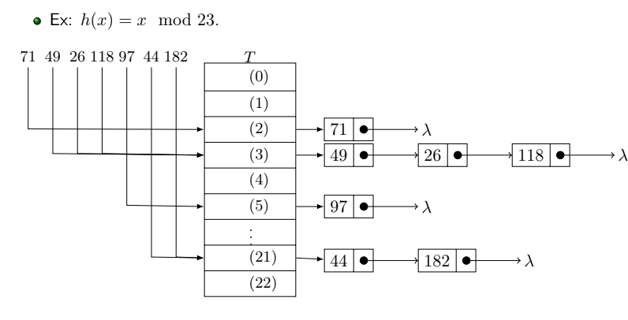

# Hashtable Simples em C

Minha implementação da estrutura de dados Hashtable em C, com base no [vídeo](https://youtu.be/YyWMN_0g3BQ?t=1297), fazendo algumas modificações.

O elemento da lista é composto por uma chave (string), que será usada para achar seu indice na lista da hashtable na hora de inserir/pesquisar, um valor (string), que é o dado que esse nó armazena, e um ponteiro para o próximo elemento da lista ligada.

```c
typedef struct node
{
    string key;
    string value;
    struct node *next;
} Node;
```

A estrutura da hashtable é composta por uma lista, onde ficarão as listas ligadas com os elementos, e um ponteiro para uma função hash.

```c
typedef struct hashtable
{
    Node *list[HASHTABLE_SIZE];
    unsigned int (*hashFunction)(string key);
} Hashtable;

```

Exemplo de função hash, encontrada no arquivo `hashfunctions.c` (tem poucas ainda):

```c
unsigned int sdbm(string key) {
    unsigned long hash = 0;
    unsigned int chr;

    while (chr = *key++) {
        hash = chr + (hash << 6) + (hash << 16) - hash; // hash * 65599 + chr
    }

    return hash % HASHTABLE_SIZE;
}
```

Exemplo em imagem de uma hashtable que peguei no slide do professor hehe:




